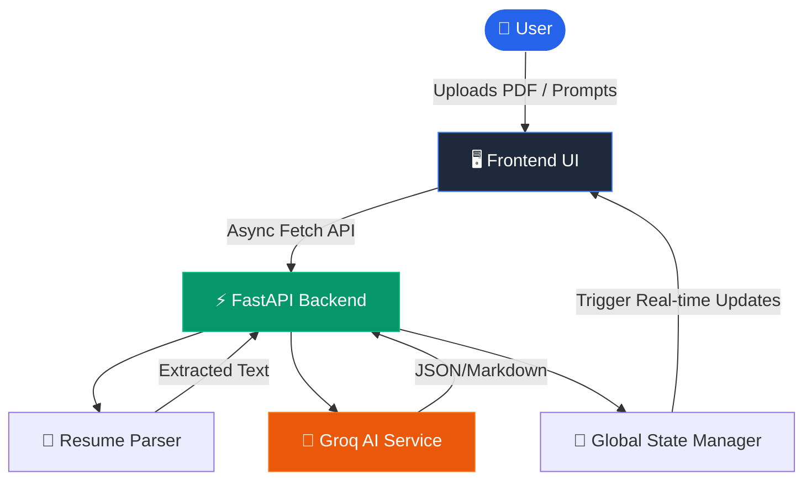

<div align="center">

# 🚀 AI Career Assistant Pro

*A production-ready, AI-powered platform for intelligent career acceleration, offering ATS scoring, multi-job matching, resume rewriting, and comprehensive interview preparation.*

[](https://python.org)
[](https://fastapi.tiangolo.com/)
[](https://docker.com)
[](https://groq.com)
[](LICENSE)
[]()

</div>

---

# 📸 Application Screenshots

## 1️⃣ Dashboard

Real-time analytics dashboard showing your global ATS score, jobs matched, salary estimates, and best target roles. Live data orchestration syncs across all tools automatically.


--------------------------------------------------

## 2️⃣ Resume Analyzer

In-depth ATS parsing to identify exactly what keywords are missing from your resume compared to a target job description.

.jpeg)

--------------------------------------------------

## 3️⃣ Multi Job Analyzer

.jpeg)
.jpeg)

--------------------------------------------------

## 4️⃣ Resume Rewrite

.jpeg)

--------------------------------------------------

## 5️⃣ Cover Letter Generator

.jpeg)

--------------------------------------------------

## 6️⃣ Interview Prep

.jpeg)

--------------------------------------------------

## 7️⃣ Career Roadmap

.jpeg)

--------------------------------------------------

## 8️⃣ Salary Predictor

.jpeg)

--------------------------------------------------

## 9️⃣ Job Recommendation Engine

.jpeg)

--------------------------------------------------

## 📑 Table of Contents

1. [About Project](#-about-project)
2. [Key Features](#-key-features)
3. [Tech Stack](#-tech-stack)
4. [System Architecture](#-system-architecture)
5. [Folder Structure](#-project-folder-structure)
6. [Installation Guide](#-installation-guide)
7. [Docker Setup](#-docker-setup)
8. [Environment Variables](#-environment-variables)
9. [Usage Guide](#-usage-guide)
10. [API Endpoints](#-api-endpoints)
11. [Complexity Notes](#-complexity-notes)
12. [Security Features](#-security-features)
13. [Deployment Guide](#-deployment-guide-aws-ec2)
14. [Troubleshooting](#-troubleshooting)
15. [Testing Guide](#-testing-guide)
16. [Future Enhancements](#-future-enhancements)
17. [Contributing](#-contributing-guide)
18. [License](#-license)
19. [Author](#-author)

---

## 💡 About Project

The **AI Career Assistant Pro** is an enterprise-grade SaaS application designed to help job seekers bypass rigid ATS (Applicant Tracking Systems). Instead of blindly applying, users can upload their resume, paste multiple job descriptions simultaneously, and receive exact missing keyword analytics, match scores, and automated ATS-friendly resume rewrites. 

**Problems Solved:**
- Eliminates "Resume Black Holes" by explicitly matching candidate skills against specific JD requirements.
- Reduces time spent tailoring resumes from hours to seconds using automated rewrite pipelines.
- Prevents interview anxiety by generating customized mock questions based on specific job roles.

**Target Audience:** Job Seekers, Recruiters, Career Coaches, and University Career Centers.

---

## 🔥 Key Features

- 📄 **Resume Upload & Parsing**: Robust extraction from `PDF` and `DOCX` formats.
- 🎯 **ATS Analysis**: Precise calculation of ATS score based on exact skill intersection.
- 🔑 **Missing Keywords**: Direct feedback on missing technical and soft skills.
- ♾️ **Multi-Job Matching**: Compare a single resume against 3+ job descriptions simultaneously.
- ✍️ **Resume Rewrite**: Context-aware, tone-configurable AI rewriting of resume contents.
- ✉️ **Cover Letter Generation**: Hyper-personalized cover letters utilizing candidate history and company details.
- 🎤 **Interview Prep**: Role-specific mock interview questions generation.
- 💰 **Salary Prediction**: AI-driven salary estimates based on region, role, and experience.
- 🗺️ **Career Roadmap**: Step-by-step upskilling guidance.
- 📊 **Live Dashboard**: Real-time state management updating ATS scores, matched jobs, and best target roles automatically.

---

## 🛠️ Tech Stack

| Tier | Technologies |
| :--- | :--- |
| **Frontend** | HTML5, Vanilla CSS (Glassmorphism UI), JavaScript (ES6+), FontAwesome |
| **Backend** | Python 3.11+, FastAPI, Uvicorn |
| **Database** | In-Memory Global State (Production-ready abstraction for MySQL/PostgreSQL migration) |
| **AI / LLMs** | Groq API (Llama 3 70B, Mixtral 8x7B) with dynamic Model Selection |
| **Parsing** | `pdfminer.six`, `python-docx` |
| **Deployment** | Docker, Docker Compose, AWS EC2 |

---

## 🏗️ System Architecture



### Architecture Rationale
A decoupled monolith approach was chosen. FastAPI provides maximum throughput (ASGI) and automatic OpenAPI validation, crucial for unpredictable AI JSON outputs. Vanilla JS removes bundle-size bloat and ensures instantaneous load times, simulating an SPA feel without the overhead of React/Next.js for this specific dashboard utility.

---

## 📁 Project Folder Structure

```text
ai-career-assistant/
├── backend/
│   ├── main.py                 # FastAPI Application Entrypoint
│   ├── schemas.py              # Pydantic Models & Validation
│   ├── state.py                # Global In-Memory Dashboard State
│   ├── routes/
│   │   ├── resume.py           # Multi-job & Single-job Analysis
│   │   ├── cover.py            # Cover Letter Generation
│   │   ├── dashboard.py        # Real-time state polling
│   │   ├── salary.py           # Salary Predictions
│   │   └── ...
│   ├── services/
│   │   ├── groq_service.py     # AI Integration & Fallback logic
│   │   └── parser.py           # PDF/DOCX Extraction
├── frontend/
│   ├── index.html              # Landing Page
│   ├── dashboard.html          # Main Application Dashboard
│   ├── css/
│   │   └── style.css           # Premium UI Styling
│   ├── js/
│   │   └── dashboard.js        # State orchestration & API fetch
├── docs/                       # Project Screenshots
├── .env                        # Environment Config
├── docker-compose.yml          # Container Orchestration
├── Dockerfile                  # Application Container image
├── requirements.txt            # Python Dependencies
└── README.md                   # Documentation
```

---

## ⚙️ Installation Guide

### Prerequisites
- Python 3.11+
- Git
- Groq API Key

### Step-by-Step Setup

1. **Clone the Repository**
   ```bash
   git clone https://github.com/yourusername/ai-career-assistant.git
   cd ai-career-assistant
   ```

2. **Create a Virtual Environment**
   ```bash
   python -m venv venv
   source venv/bin/activate  # macOS/Linux
   .\venv\Scripts\activate   # Windows
   ```

3. **Install Dependencies**
   ```bash
   pip install -r requirements.txt
   ```

4. **Setup Environment Config**
   Copy the example config and populate your keys.
   ```bash
   cp .env.example .env
   # Add your GROQ_API_KEY
   ```

5. **Start the Backend Server**
   ```bash
   uvicorn backend.main:app --reload
   ```

6. **Access the Frontend**
   Open your browser and navigate to:
   `http://localhost:8000/static/index.html`

---

## 🐳 Docker Setup

For immediate production-ready execution without local Python environments:

1. **Build and Run the Container**
   ```bash
   docker-compose up -d --build
   ```

2. **Stop the Container**
   ```bash
   docker-compose down
   ```

---

## 🔒 Environment Variables

Create a `.env` file in the root directory:

```env
# AI Services
GROQ_API_KEY=gsk_your_api_key_here
OPENAI_API_KEY=sk_optional_fallback_key

# Database (Future Migration)
DB_HOST=localhost
DB_USER=admin
DB_PASSWORD=secret
```

---

## 📖 Usage Guide

1. **Multi-Job Resume Matcher**: 
   - Navigate to the Dashboard.
   - Drag & drop your PDF/DOCX resume.
   - Click the predefined job buttons (e.g., "MLOps Engineer") or enter custom Job Descriptions.
   - Click "Analyze". The dashboard updates automatically.
2. **Universal Resume Rewrite**:
   - Review the missing keywords from the Multi-Job Analyzer.
   - Click "Create Universal Resume Version" to automatically port missing skills to the rewriter module.
3. **Cover Letters**:
   - Navigate to Cover Letters, upload your resume, define the target company, and instantly generate a PDF cover letter.

---

## 🔌 API Endpoints

| Method | Endpoint | Description |
| :--- | :--- | :--- |
| `GET` | `/dashboard/stats` | Fetches live global dashboard state |
| `POST`| `/dashboard/reset` | Resets global dashboard memory |
| `POST`| `/resume/analyze-multi` | Analyzes 1 resume against N jobs |
| `POST`| `/resume/rewrite` | AI-rewrites resume based on JD |
| `POST`| `/cover-letter/upload-generate` | Parses PDF & creates tailored letter |
| `POST`| `/salary/predict` | Predicts salary and updates state |

*Full Swagger Documentation available at `http://localhost:8000/docs`*

---

## ⏱️ Complexity Notes

- **Resume Parsing Engine**: `O(N)` space and time complexity, where `N` is the number of characters in the PDF.
- **Local Fallback Keyword Matcher**: `O(M * (W_j + W_r))` time complexity, where `M` is the number of jobs, `W_j` is words in JD, and `W_r` is words in Resume. Leverages Python `set` intersections for `O(1)` amortized lookup.
- **State Polling**: `O(1)` memory lookup. Frontend triggers updates event-driven rather than continuous long-polling to save bandwidth.

---

## 🛡️ Security Features

- **File Validation**: Strict multi-layer MIME/extension checking preventing malicious uploads.
- **Payload Limits**: Hard 5MB memory limit on `UploadFile` processing.
- **Memory Safety**: Temporary OS directory management (`backend/temp`) automatically unlinks and scrubs prior user uploads instantly.
- **API Guarding**: CORS middleware configured strictly. Environment variables managed via `python-dotenv`.

---

## ☁️ Deployment Guide (AWS EC2)

1. Launch an Ubuntu 22.04 instance.
2. SSH into the instance:
   ```bash
   ssh -i key.pem ubuntu@your-ec2-ip
   ```
3. Update and install Docker:
   ```bash
   sudo apt update && sudo apt upgrade -y
   sudo apt install docker.io docker-compose -y
   ```
4. Clone repo and create `.env`:
   ```bash
   git clone https://github.com/yourusername/ai-career-assistant.git
   cd ai-career-assistant
   nano .env
   ```
5. Deploy:
   ```bash
   sudo docker-compose up -d --build
   ```
6. Setup NGINX reverse proxy (Optional but recommended for port 80/443 SSL wrapping).

---

## 🚑 Troubleshooting

- **AI Returns "Error connecting to AI service" or "Invalid Format"**
  - *Cause*: Groq API rate limits exceeded, or invalid `GROQ_API_KEY`.
  - *Fix*: The backend automatically falls back to manual local keyword scoring. Check `.env` or wait 60s for rate reset.
- **Frontend shows "Network Error" or "Failed to fetch"**
  - *Cause*: CORS issue or backend server down.
  - *Fix*: Ensure Uvicorn or Docker container is running on `0.0.0.0:8000`.
- **PDF Upload Fails**
  - *Cause*: Scanned PDFs (images) cannot be read by `pdfminer.six`.
  - *Fix*: Provide a text-based PDF or paste text manually into the fallback textbox.

---

## 🧪 Testing Guide

To validate system integrity:

1. **Resume Upload Tests**: Upload large PDFs (5MB+) and invalid formats (`.exe`, `.jpg`) to verify HTTP 400 rejection handling.
2. **Multi-Job Fallback**: Temporarily delete your `GROQ_API_KEY`. Run an analysis to verify the local native Python intersection scoring executes flawlessly without throwing 500 errors.
3. **State Mutation**: Run an analysis on tab 1, and ensure tab 2's dashboard auto-refreshes correctly on load.

---

## 🚀 Future Enhancements

- [ ] **OAuth Authentication**: Google & GitHub SSO Integration.
- [ ] **PostgreSQL Migration**: Move from in-memory state to persistent User schema DB mapping.
- [ ] **Stripe Payment Gateway**: Token-based usage billing.
- [ ] **AI Voice Interviews**: WebRTC pipeline for real-time vocal mock interviews.

---

## 🤝 Contributing Guide

We welcome contributions from the community! 

1. Fork the Project
2. Create your Feature Branch (`git checkout -b feature/AmazingFeature`)
3. Commit your Changes (`git commit -m 'Add some AmazingFeature'`)
4. Push to the Branch (`git push origin feature/AmazingFeature`)
5. Open a Pull Request

---

## 📝 License

Distributed under the MIT License. See `LICENSE` for more information.

---

## 👤 Author

**Developed with ❤️ by a Ai & MLOps Engineer**

- GitHub: [@yourusername](https://github.com/bittush8789)

---

<div align="center">
  <b>If you found this project helpful, please consider leaving a ⭐ on the repository!</b>
</div>
